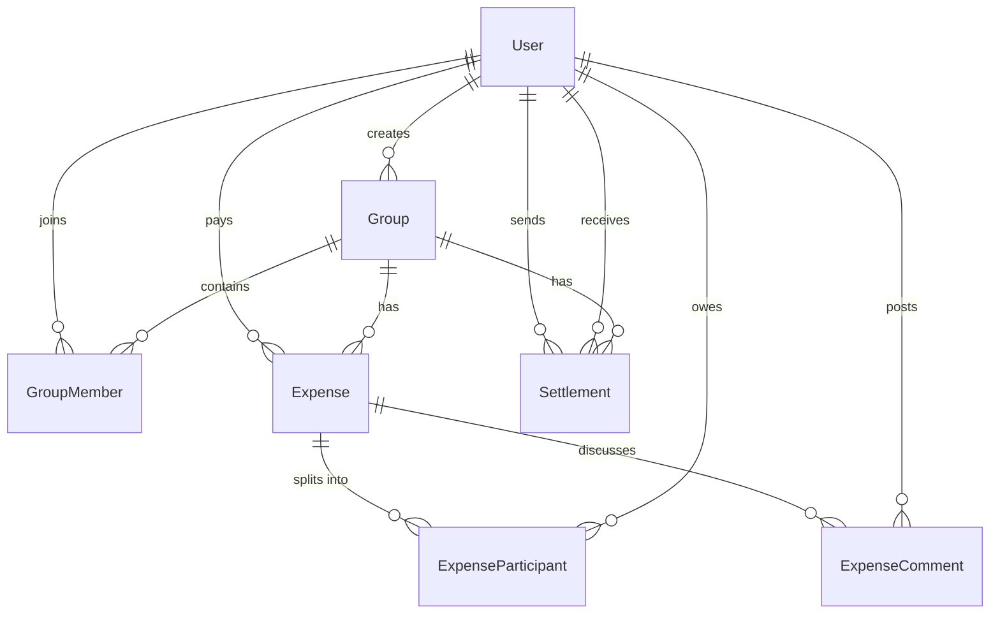

# SCOPE.md - Database Schema & CSV Anomaly Log

## 1. Database Schema
Our application uses Prisma ORM with PostgreSQL. The database is fully relational and normalized.

### Database Models & Relationships
- **User**: Represents registered users (Aisha, Rohan, Priya, Meera, Sam, Dev). Stores name, email, and password hashes.
- **Group**: Represents a shared financial space. A group is created by a User and has many members, expenses, and settlements.
- **GroupMember**: Represents memberships of users in groups. Maintains roles (e.g. ADMIN, MEMBER) and join dates, allowing memberships to change dynamically.
- **Expense**: Represents a shared cost transaction. Belongs to a Group, is paid by a User, has a split method, and has many participants.
- **ExpenseParticipant**: Represents a user's share of a specific expense. Stores `owedAmount` (in Integer units/rupees), percentage, and shares weights.
- **Settlement**: Represents a debt clearance payment from one user to another. Belongs to a Group, paid by a User, paid to a User, and has an amount.
- **ExpenseComment**: Represents lightweight comments on expenses.

---

## 2. Anomaly Log (12 Deliberate Data Problems)

We have mapped the following 12 data problems in `expenses_export.csv` and created explicit detection and resolution policies:

| # | Anomaly Type | Detection Rule | Handling Policy |
|---|---|---|---|
| 1 | **Duplicate Expense** | Matches identical description, amount, date, and payer. | Skip importing by default (un-checked in wizard). User can override and force keep. |
| 2 | **Settlements as Expenses** | Regex search in title/description for "settle", "payment", "paid back", "payback". | Wizard proposes importing as a Settlement record (which decreases debt ledger directly) rather than an Expense. |
| 3 | **Priya's USD Trip Cost** | Amount prefixed with `$` or Currency column set to `USD`. | Warns user and converts amount to INR at 1 USD = ₹83 (configurable in UI). |
| 4 | **Sam's Pre-join Expenses** | Sam is included in splits for an expense dated before his join date (April 15, 2026). | Sam is excluded from the split. His share is redistributed among the other active members. |
| 5 | **Meera's Post-leave Expenses** | Meera is included in splits for an expense dated after her move-out date (March 31, 2026). | Meera is excluded from the split. Her share is redistributed among the active members. |
| 6 | **Negative Expense Amount** | Total amount column value is negative (e.g. -150). | Treated as a refund. The absolute amount is imported, and the split is reversed. |
| 7 | **Empty Description** | Row has no title/description text. | Auto-names the expense as "Imported Expense [RowNumber]" to maintain auditability. |
| 8 | **Inconsistent Name Spacing** | Name casing mismatch (e.g. "aisha", "Meera ") or extra spacing. | Case-insensitive trim-based normalization to match registered users. |
| 9 | **Invalid Date Format** | JS `Date.parse(date)` returns NaN. | Logs error, prompts user, and falls back to the current date to prevent import crashes. |
| 10 | **Math Split Mismatch** | Sum of individual split columns !== Total Cost. | Recalculates splits equally, assigning any rounding difference (in paise/rupee) to the payer. |
| 11 | **Zero Cost Row** | Amount is equal to 0. | Skips importing since a zero-amount transaction does not alter balances. |
| 12 | **Unknown Group Payer** | Payer name is not found in group members list. | Warns user and prompts them to select a valid group member as payer. |
